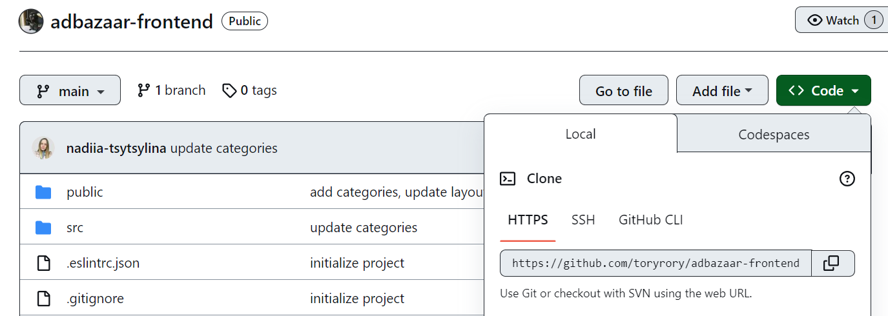
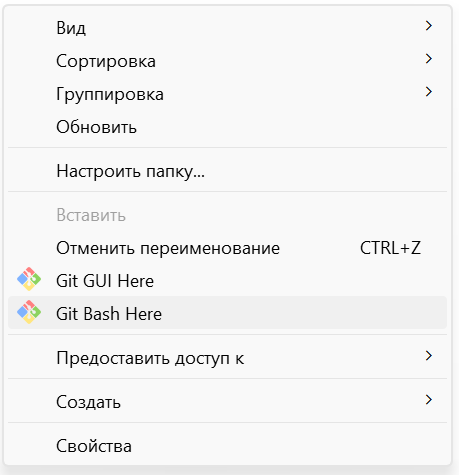

## ADBAZAAR FRONTEND

Backend part of our project: [Adbazaar Backend](https://github.com/MinoUni/adbazaar)

## 1. About the project

The 'AdBazaar' project is dedicated to developing an MVP for a mobile app marketplace. The entry point was high-level requirements that were crystallized by the team and transferred into epics, user stories, and tasks. The project has a duration of 4 months and follows the Scrum methodology.
The 'AdBazaar' platform is a self-contained mobile app serving as an online book marketplace where users can buy and sell products. It includes features like a search engine, sorting, user account management, favorites, pagination, book category filtering, and user profile management. While the primary focus is on paper books, the platform can be expanded to include other product categories in the future.

## 2. Technology stack

- Next.js
- React
- Redux Toolkit
- Redux Persist
- Axios
- Styled Component

## 3. Quick setup

Install [Node Lts](https://nodejs.org/)

Install [Git](https://git-scm.com/downloads)

Install [VS Code](https://code.visualstudio.com/download)

1. Clone repo (tap button 'Code', and copy link in repository)
   

2. Open file storage in PC, create a folder with project

3. Open git bash terminal in project folder (click right mouse button)
   

4. In git bash terminal run command, where repositoryLink - link, that you copied in the first step.

   ```bash
   git clone repositoryLink
   ```

5. After project files have loaded, open project folder in VScode.
   Press "ctrl + shift + `" to open terminal or open it like on the screenshot:
   

6. Run command to install dependencies

   ```bash
   npm install
   ```

7. Run command to pull latest changes from github repository

   ```bash
    git pull
   ```

8. Start dev server

   ```bash
   npm run dev
   ```

   Runs the app in the development mode.

9. Open http://localhost:3000 to view it in your browser.

The page will reload when you make changes.
You may also see any lint errors in the console.
