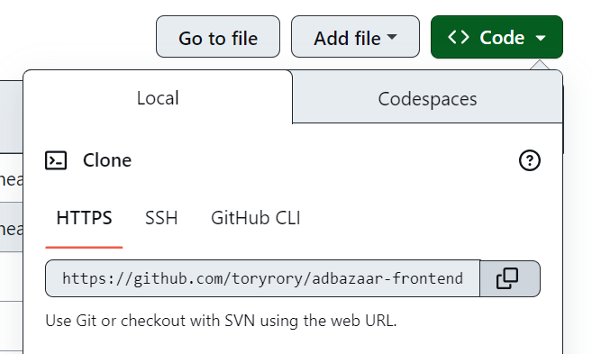

## ADBAZAAR FRONTEND

## Quick setup

Install [Node Lts](https://nodejs.org/)

Install [Git](https://git-scm.com/downloads)

1. Clone repo (tap button 'Code', and copy link in repository)
   

2. Open file storage in PC, create a folder with project

3. Open git bash terminal in project folder (click right mouse button)
   

4. In git bash terminal run command, where repositoryLink - link, that you copied in the first step.

   ```bash
   git clone repositoryLink
   ```

5. After project files have loaded, open project folder in VScode.
   Press "ctrl + shift + `" to open terminal or open it like on the screenshot:
   

6. Run command to install dependencies

   ```bash
   npm install
   ```

7. Run command to pull latest changes from github repository

   ```bash
    git pull
   ```

8. Start dev server

   ```bash
   npm run dev
   ```

   Runs the app in the development mode.

9. Open http://localhost:3000 to view it in your browser.

The page will reload when you make changes.
You may also see any lint errors in the console.

## Next.js

This is a [Next.js](https://nextjs.org/) project bootstrapped with [`create-next-app`](https://github.com/vercel/next.js/tree/canary/packages/create-next-app).

## Getting Started

First, run the development server:

```bash
npm run dev
# or
yarn dev
# or
pnpm dev
```

Open [http://localhost:3000](http://localhost:3000) with your browser to see the result.

You can start editing the page by modifying `pages/index.js`. The page auto-updates as you edit the file.

[API routes](https://nextjs.org/docs/api-routes/introduction) can be accessed on [http://localhost:3000/api/hello](http://localhost:3000/api/hello). This endpoint can be edited in `pages/api/hello.js`.

The `pages/api` directory is mapped to `/api/*`. Files in this directory are treated as [API routes](https://nextjs.org/docs/api-routes/introduction) instead of React pages.

This project uses [`next/font`](https://nextjs.org/docs/basic-features/font-optimization) to automatically optimize and load Inter, a custom Google Font.

## Learn More

To learn more about Next.js, take a look at the following resources:

- [Next.js Documentation](https://nextjs.org/docs) - learn about Next.js features and API.
- [Learn Next.js](https://nextjs.org/learn) - an interactive Next.js tutorial.

You can check out [the Next.js GitHub repository](https://github.com/vercel/next.js/) - your feedback and contributions are welcome!

## Deploy on Vercel

The easiest way to deploy your Next.js app is to use the [Vercel Platform](https://vercel.com/new?utm_medium=default-template&filter=next.js&utm_source=create-next-app&utm_campaign=create-next-app-readme) from the creators of Next.js.

Check out our [Next.js deployment documentation](https://nextjs.org/docs/deployment) for more details.
